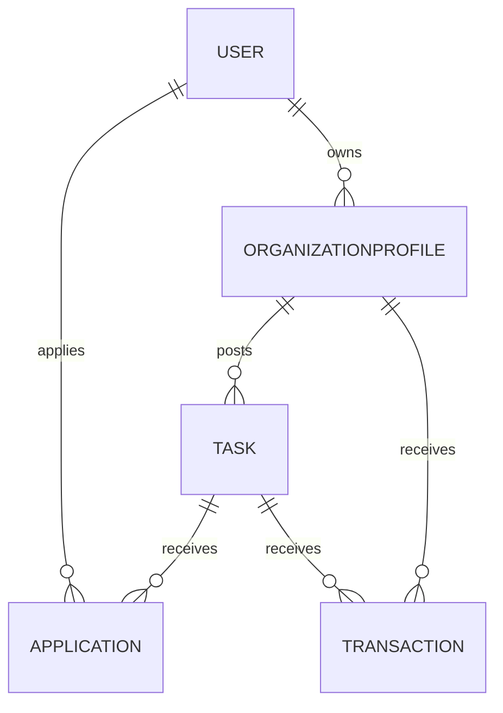

# Backend Documentation

## Backend Overview

- **Purpose:** Implements REST API for users, NGOs, tasks, applications and donations.
- **Tech stack:** Node.js, Express, Mongoose (MongoDB), Cloudinary for uploads.
- **Entry point:** [Backend/index.js](Backend/index.js#L1)

## Architecture approach
- Controller-driven design: controllers handle request logic using Mongoose models. Middleware is used for authentication, authorization and file uploads.

## Folder Structure (Backend)
- `index.js` - Server, route mounting and top-level endpoints.
- `config/configDb.js` - Mongoose connection (uses `DB_URL`).
- `app/controller/` - Controllers: `user-Controller.js`, `ngo-Controller.js`, `task-Controller.js`, `application-controller.js`, `donation-controller.js`.
- `app/model/` - Mongoose schemas: `user-Schema.js`, `organizationProfile-Schema.js`, `task-Schema.js`, `application-Schema.js`, `transaction-Schema.js`.
- `app/middleware/` - `authenticateUser.js`, `authorizeUser.js`, `uploadCloudinary.js`.
- `app/validations/` - Joi validation rules.
- `app/utils/` - helpers (e.g., Cloudinary cleanup).

## Request lifecycle

Client → Route (index.js) → Middleware (`authenticateUser`/`authorizeUser`/`upload`) → Controller → Model (Mongoose) → Response

## Authentication
- JWT-based. `authenticateUser` reads token from `Authorization` header and sets `req.userId`, `req.role`, `req.ngoId`.
- First registered user becomes `Admin` (see `user-Controller.register`).
- Authorization middleware `authorizeUser(roles)` restricts endpoints by role.

## API Modules & Key Endpoints

- Auth / User
  - `POST /api/register` — Register user (first user => Admin).
  - `POST /api/login` — Login returns JWT.
  - `GET /api/profile` — Protected; roles: Contributor, Admin.
  - `PUT /api/user/update` — Update current user; role: Contributor.
  - `DELETE /api/user/delete/:id` — Delete user (Admin or same Contributor).
  - `GET /api/user/list` — Admin listing with filters.

- NGO
  - `POST /api/ngo/register` — Register NGO (creates User with `role: NGO`).
  - `POST /api/ngo/upload-documents` — NGO uploads verification docs (multipart, Cloudinary).
  - `PUT /api/ngo/verify/:id` — Admin verifies/rejects NGO.
  - `GET /api/ngo/profile` — NGO profile; roles: NGO, Admin.
  - `PUT /api/ngo/update` — Update NGO info (NGO role; supports profile pic upload).
  - `DELETE /api/ngo/delete` — NGO deletes own account and associated tasks.
  - `GET /api/ngo/list` — Admin: list NGOs.
  - `DELETE /api/ngo/admin/:id` — Admin deletes NGO and user.
  - `GET /api/ngo/profile/:id` — Admin/Contributor fetch NGO by id.
  - `GET /api/admin/stats` — Aggregated admin stats.

- Task
  - `POST /api/task` — NGO creates task (file upload allowed).
  - `GET /api/ngo/tasks` — NGO tasks list.
  - `GET /api/tasks` — Public open tasks with search/filter.
  - `GET /api/task/:id` — Get task details.
  - `PUT /api/task/:id` — NGO updates task (image replace supported).
  - `DELETE /api/task/:id` — Admin/NGO delete task.
  - `GET /api/admin/tasks` — Admin tasks listing.
  - `GET /api/tasks/dashboard` — NGO dashboard aggregation.

- Application (volunteer)
  - `POST /api/task/apply/:id` — Contributor applies to a volunteer task.
  - `GET /api/user/applications` — Contributor's applications.
  - `GET /api/ngo/application` — NGO view applications for its tasks.
  - `PUT /api/application/status/:id` — NGO update application status.
  - `POST /api/application/log/:id` — Contributor logs hours for an application.
  - `PUT /api/application/:id/log/:logId` — Contributor updates a pending/rejected log.
  - `GET /api/ngo/logs` — NGO get pending logs.
  - `PUT /api/application/:appId/log/:logId/status` — NGO approve/reject logged hours.
  - `GET /api/application/:id` — Get application by id (Contributor/Admin).
  - `GET /api/admin/applications` — Admin listing.
  - `DELETE /api/application/:id` — Delete application (Admin/NGO/Contributor).

- Donation / Transaction
  - `POST /api/donations/:taskId` — Create simulated donation transaction and update task funding.
  - `GET /api/donation/user` — User donations (Contributor/Admin).
  - `GET /api/ngo/donation` — NGO donations.

## Database Documentation (models)

- `User` (`app/model/user-Schema.js`)
  - Fields: `email`, `password`, `firstName`, `lastName`, `mobileNumber`, `role` (Admin, NGO, Contributor), `location`, `loginCount`, `socketId`.

- `OrganizationProfile` (`organizationProfile-Schema.js`)
  - Fields: `user` (ref User), `ngoName`, `regNumber`, `contactEmail`, `coordinatorAadhaarUrl`, `ngoLicenseUrl`, `ngoProfilePic`, `status` (Pending|Verified|Rejected), `isPremium`, `premiumExpiryDate`, `lastFundingDate`.

- `Task` (`task-Schema.js`)
  - Fields: `ngo` (ref OrganizationProfile), `createdBy` (User), `title`, `description`, `location`, `taskType` (Volunteer|funding), `requiredHours`, `fundingGoal`, `currentFund`, `deadline`, `images`, `isFeatured`, `taskStatus` (Open|Completed|Archived), `volunteersNeeded`, `aiVettingScore`.

- `Application` (`application-Schema.js`)
  - Fields: `applicant` (User), `task` (Task), `ngo` (OrganizationProfile), `completionStatus`, `hoursLogged`, `hoursRequested`, `hoursLog` (array of logs with status), `rejectionReason`, `completionDate`, `certificateUrl`.

- `Transaction` (`transaction-Schema.js`)
  - Fields: `ngo` (OrganizationProfile), `donorDetails` (donorName, donorEmail, user), `transactionDetails` (purpose, task, platformFee), `transactionInfo` (amount, transactionId, orderId, status, paymentGateway).

### Relationships (Mermaid)

## Middleware
- `authenticateUser` — verifies JWT from `Authorization` header and injects `req.userId`, `req.role`, `req.ngoId`.
- `authorizeUser(roles)` — returns middleware to restrict access to specified roles.
- `uploadCloudinary` — multer + CloudinaryStorage middleware used for NGO and Task file uploads.

## External integrations
- **Cloudinary** — used for file storage. Config via `CLOUD_NAME`, `API_KEY`, `API_SECRET`.
- **Razorpay** — referenced as payment gateway in transaction model; current donation flow simulates success.

## Environment Variables

| Variable | Purpose |
|---|---|
| `DB_URL` | MongoDB connection string used by `configDb.js` |
| `JWT_SECRET` | Secret key for signing JWTs |
| `PORT` | Server port (defaults to 3070) |
| `CLOUD_NAME` | Cloudinary cloud name |
| `API_KEY` | Cloudinary API key |
| `API_SECRET` | Cloudinary API secret |

## Error handling
- Controllers return `400` for validation errors, `401`/`403` for auth errors, `404` for not found, and `500` for server errors. Check server logs (console) for stack traces during development.

## Testing
- No automated tests found. Recommend adding Jest/Supertest for API endpoints and Playwright for E2E.

## Deployment
- Ensure all env vars above are set on the host. Use process manager (`pm2`) or host provider to run `npm start`.
