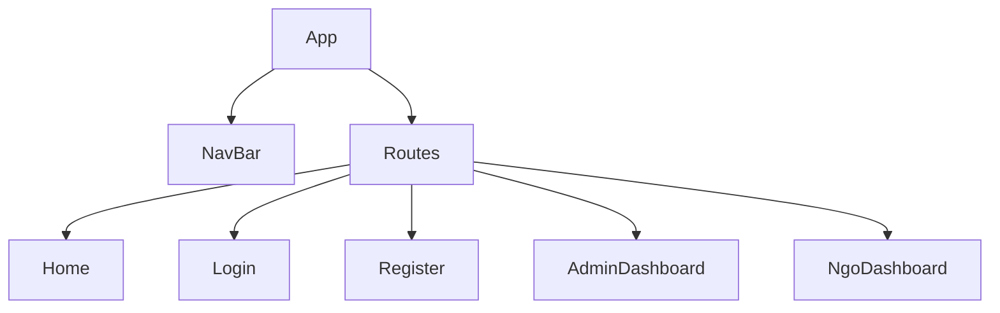

# Frontend Documentation

## Frontend Overview

- **Purpose:** React UI for CommonHands. Provides pages for public browsing, authentication, NGO workflows, admin dashboards and user profiles.
- **Tech stack:** React (Vite), React Router, Redux Toolkit, Axios, Tailwind (configured), Formik/Yup for forms.
- **Entry point:** `src/main.jsx` — sets up router, Redux provider and `AuthProvider`.

## Folder Structure (important folders)
- `src/Pages/` — top-level pages and route components (Home, Login, Register, Admin/*, NGO/*, User/*).
- `src/components/` — UI building blocks and Radix-based UI primitives under `ui/`.
- `src/config/axios.jsx` — central axios instance; currently points to `https://commonhands.onrender.com`.
- `src/Store/` — Redux store factory (`store.jsx`).
- `src/Slices/` — Redux slices (`AdminSlice.jsx`, `NgoSlice.jsx`).
- `src/Context/` — `userContext.jsx` used for authentication state.

## Application Flow

Client (UI) → API call via `axios` instance → Backend `/api/*` → Response → Redux/Context update → UI refresh

## Routing
- Routes are declared in `src/App.jsx`.

Major routes include:
- `/` — Home
- `/login` — Login
- `/register` — User register
- `/registerNgo` — NGO onboarding
- `/uploadDoc` — NGO document upload
- `/profile` — User profile
- `/tasks` — Public tasks list
- `/ngo/*` — NGO pages (`/ngo/tasks`, `/ngo/dashboard`, `/ngo/application`, `/ngo/donation`)
- `/admin/*` — Admin area (`/admin/dashboard`, `/admin/ngo`, `/admin/tasks`, `/admin/users`, `/admin/applications`)

## Pages (examples)
- `Home` — Landing page; consumes public tasks API.
- `Login` — calls `POST /api/login` and stores token in `localStorage`.
- `Register` / `Register-Ngo-one` / `register-Ngo-two` — Signup flows for users and NGOs.
- `UploadDoc` — NGO document upload page uses form-data to `POST /api/ngo/upload-documents`.
- `Profile` — reads `GET /api/profile` using token.

## Components
- UI primitives under `src/components/ui/*` (button, input, dialog, table, etc.) are reusable across pages.
- `AuthProvider.jsx` handles authentication state and provides helper methods to children.

## State Management
- Redux Toolkit is used. Store created in `src/Store/store.jsx` and provided in `main.jsx`.
- Notable slices:
  - `NgoSlice.jsx` — async thunks: `fetchNgoProfile`, `fetchNgoDashboard`, `fetchNgoTasks` using `src/config/axios.jsx` and `localStorage` token.
  - `AdminSlice.jsx` — admin related state (exists in `src/Slices`).
- Local component state and Formik are used for forms.

## API Integration Layer
- Central axios instance: `src/config/axios.jsx` (baseURL points to production URL). For local development update this to `http://localhost:3070` or use an env-backed value.
- Requests include `Authorization` header populated from `localStorage.getItem('token')` in the slices.

## Authentication Flow
- Login stores JWT in `localStorage` under `token`.
- Protected data requests add header `Authorization: <token>`; backend middleware verifies the token.
- `AuthProvider` controls login/logout UI state.

## UI Architecture Diagrams



## Forms & Validation
- Forms use Formik + Yup (Yup used for client-side validation; server-side Joi validations also exist in backend).

## Environment Variables

| Variable | Purpose |
|---|---|
| `VITE_API_URL` (suggested) | Base API URL to replace hard-coded `src/config/axios.jsx` value |

## Build & Run

Development

```bash
cd Frontend
npm install
npm run dev
```

Production build

```bash
npm run build
```

## Troubleshooting
- If API calls return CORS or network errors, verify `src/config/axios.jsx` `baseURL` and backend is running and reachable.
- If auth fails, ensure `localStorage.token` is set by successful login and token header is sent.
# React + Vite

This template provides a minimal setup to get React working in Vite with HMR and some ESLint rules.

Currently, two official plugins are available:

- [@vitejs/plugin-react](https://github.com/vitejs/vite-plugin-react/blob/main/packages/plugin-react) uses [Babel](https://babeljs.io/) (or [oxc](https://oxc.rs) when used in [rolldown-vite](https://vite.dev/guide/rolldown)) for Fast Refresh
- [@vitejs/plugin-react-swc](https://github.com/vitejs/vite-plugin-react/blob/main/packages/plugin-react-swc) uses [SWC](https://swc.rs/) for Fast Refresh

## React Compiler

The React Compiler is not enabled on this template because of its impact on dev & build performances. To add it, see [this documentation](https://react.dev/learn/react-compiler/installation).

## Expanding the ESLint configuration

If you are developing a production application, we recommend using TypeScript with type-aware lint rules enabled. Check out the [TS template](https://github.com/vitejs/vite/tree/main/packages/create-vite/template-react-ts) for information on how to integrate TypeScript and [`typescript-eslint`](https://typescript-eslint.io) in your project.
